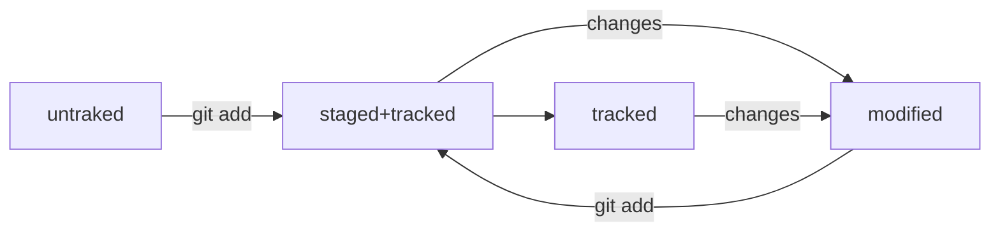

# Памятка по работе с Git и GitHub

# 

## Установка Git

1. Перейдите [на эту страницу официального сайта Git.](https://git-scm.com/download/win)  
2. Скачайте одну из двух версий из категории Standalone Installer (англ. «автономный установщик»).
3. Запустите программу установки. Обратите внимание, куда будет установлен Git. Обычно это директория C:\Program Files\Git  
4. Проверьте, что в списке устанавливаемых программ стоит галочка напротив пункта Git Bash Here — это позволит открывать консоль с Git в любой папке. 
5. Далее установщик предложит много опций. Для наших целей достаточно оставить все настройки по умолчанию.  
Несколько раз нажмите Next (англ. «далее»), пока не начнётся процесс установки.
6. После окончания установки нажмите Finish (англ. «завершить»).

### Запустите программу Git Bash

Откроется консоль, в которой будет написано что-то похожее.

Вместо USER_NAME будет указано ваше имя пользователя, а вместо HOST_NAME — имя компьютера.

### Работа в терминале (Командная строка Git)

##### Если вы пользователь macOS или Linux, запустите программу Terminal.

- для Linux — Ctrl+Alt+T;
- для macOS — Cmd+Space, затем ввести terminal.

##### Если вы пользователь Windows

- запустите программу Git Bash.

## Навигация

- pwd (от англ. print working directory, «показать рабочую папку») — покажи, в какой я папке;
- ls (от англ. list directory contents, «отобразить содержимое директории») — покажи файлы и папки в текущей папке;
- ls -a — покажи также скрытые файлы и папки, названия которых начинаются с символа .;
- cd first-project (от англ. change directory, «сменить директорию») — перейди в папку first-project;
- cd first-project/html — перейди в папку html, которая находится в папке first-project;
- cd .. — перейди на уровень выше, в родительскую папку;
- cd ~ — перейди в домашнюю директорию (/Users/Username);
- cd / — перейди в корневую директорию.

## Работа с файлами и папками

### Создание

- touch index.html (англ. touch, «коснуться») — создай файл index.html в текущей папке;
- touch index.html style.css script.js — если нужно создать сразу несколько файлов, можно напечатать их имена в одну строку через пробел;
- mkdir second-project (от англ. make directory, «создать директорию») — создай папку с именем second-project в текущей папке.

### Копирование и перемещение

- `cp file.txt ~/my-dir` (от англ. copy, «копировать») — скопируй файл в другое место;
- `mv file.txt ~/my-dir` (от англ. move, «переместить») — перемести файл или папку в другое место.

### Чтение

- `cat file.txt` (от англ. concatenate and print, «объединить и распечатать») — распечатай содержимое текстового файла file.txt.

### Удаление

- `rm about.html` (от англ. remove, «удалить») — удали файл about.html;
- `rmdir images` (от англ. remove directory, «удалить директорию») — удали папку images;
- `rm -r second-project` (от англ. remove, «удалить» + recursive, «рекурсивный») — удали папку second-project и всё, что она содержит.

## Полезные возможности

- Команды необязательно печатать и выполнять по очереди. Можно указать их списком — разделить двумя амперсандами (&&).
- У консоли есть собственная память — буфер с несколькими последними командами. По ним можно перемещаться с помощью клавиш со стрелками вверх (↑) и вниз (↓).
- Чтобы не вводить название файла или папки полностью, можно набрать первые символы имени и дважды нажать Tab. Если файл или папка есть в текущей директории, командная строка допишет путь сама.

## Инициализируем репозиторий

### Сделать папку репозиторием — `git init`

Чтобы Git начал отслеживать изменения в проекте, папку с файлами этого проекта нужно сделать Git-репозиторием (от англ. repository — «хранилище»). Для этого следует переместиться в неё и ввести команду `git init` (от англ. initialize — «инициализировать»).
Например, создайте папку <название> и сделайте её Git-репозиторием: перейдите в неё с помощью команды cd и выполните `git init`.

```
$ cd ~/dev/first-project # перешли в нужную папку

$ git init # создали репозиторий
```

### «Разгитить» папку, если что-то пошло не так, `— rm -rf .git`

Если вы случайно сделали Git-репозиторием не ту папку, её можно «разгитить». Для этого нужно удалить скрытую подпапку .git.

```
$ cd <папка с репозиторием> # перешли в папку

$ rm -rf .git # удалили подпапку .git
```

Разберём подробнее, что такое `-rf`:

- ключ `-r` (от англ. recursive — «рекурсивно») позволяет удалять папки вместе с их содержимым;
- ключ `-f` (от англ. force — «заставить») избавит вас от вопросов вроде «Вы точно хотите удалить этот файл? А этот? И этот тоже?».

### Проверить состояние репозитория — `git status`

После инициализации репозитория запустите команду `git status` (от англ. status, «статус», «состояние») — она показывает текущее состояние репозитория. 

Команда `git status` выведет:

- название текущей ветки: On branch master или On branch main;
- сообщение о том, что в репозитории ещё нет коммитов: No commits yet;
- сообщение, которое говорит: «чтобы что-нибудь закоммитить (то есть зафиксировать), нужно сначала это создать» — nothing to commit (create/copy files and use "git add" to track).

## Добавляем файлы в репозиторий

### Подготовить файлы к сохранению — `git add`

```
$ git add --all # подготовили к сохранению все файлы в репозитории
$ git status # проверили статус
```
- `git add` <название файла> добавит только конкретный файл к сохранению
- `git add .` — подготовь к коммиту текущую папку и все файлы в ней.

_Команда `git add` не сохраняет содержимое файлов в репозитории. Само сохранение, или фиксацию состояния файлов, называют коммитом (от англ. commit — «совершать», «фиксировать»). «Сделать коммит» значит сохранить текущую версию файла._

Если сейчас отредактировать любой из «зелёных» файлов в папке first-project, он перейдёт в состояние modified (англ. «изменённый») и будет и в «зелёном», и в «красном» списках. 

## Делаем первый коммит

### Выполнить коммит — `git commit`

Сделать коммит можно командой `git commit` c ключом -m (от англ. message — «сообщение»), который присваивает коммиту сообщение.

```
$ git commit -m 'Мой первый коммит!'
```
### Ещё раз о разнице между `git add` и `git commit`

Сначала команда `git add` сообщает Git, какие именно файлы нужно сохранить и какую их версию. Затем с помощью команды `git commit` происходит само сохранение. 

Учтите, что после того как сделан коммит, команда `git status` будет писать on branch master nothing to commit, working tree clean, это нормально, как только вы внесёте изменения в файлы git status снова покажет текущее состояние репозитория.

### Просмотр информации о коммитах

- `git log` (от англ. log, «журнал [записей]») — выведи подробную историю коммитов.

## Регистрируемся на GitHub и создаём удалённый репозиторий

### Инструкция по созданию репозитория на GitHub

1. Зайдите в свой профиль по ссылке https://github.com/username, где username — имя, которое вы указали при регистрации.

2. Создайте репозиторий. Для этого перейдите на вкладку Repositories (англ. «репозитории»), а затем нажмите на зелёную кнопку New (англ. «новый») справа. 

3. Открылось окно создания нового репозитория. Назовите его.  Другие поля вам пока не понадобятся. Смело нажимайте на зелёную кнопку Create repository (англ. «создать репозиторий») внизу.

Осталось связать удалённый репозиторий с локальным, который уже есть на вашем компьютере. GitHub предоставляет для этого инструкцию (пункт …or push an existing repository from the command line).

Но прежде, чтобы упростить работу с GitHub и сделать её более безопасной, вы научитесь генерировать SSH-ключи (от англ. Secure Shell — «безопасная оболочка»).

SSH использует пару ключей для обеспечения безопасности — публичный и приватный: 

- **Приватный ключ** (англ. private key) хранится только на вашем компьютере и не должен передаваться кому-либо ещё. Он используется для расшифровки данных.

- **Публичный ключ** (англ. public key) доступен всем и используется для шифрования данных. Они могут быть расшифрованы парным приватным ключом.

### Проверка наличия SSH-ключа

Прежде чем генерировать SSH-ключи, убедитесь, что у вас их ещё нет. По умолчанию директория с SSH-ключами находится в домашней директории. Перейдите в неё.

```
$ cd ~ # перешли в домашнюю директорию пользователя 
```
Обычно SSH-ключи находятся в директории .ssh/. Проверить наличие этой директории и файлов в ней можно с помощью следующей команды.

```
$ ls -la .ssh/ # вывели список созданных ключей 
```

Если папка пустая или её нет, всё в порядке. Если есть файлы с похожими названиями, SSH-ключи уже создавались:

- id_dsa.pub
- id_ecdsa.pub
- id_ed25519.pub
- id_rsa.pub

Если вы не создавали эти файлы, удалите их все.

### Инструкция по генерации SSH-ключа

1. Для генерации SSH-пары можно использовать программу ssh-keygen. Откройте терминал и введите следующую команду.

```
$ ssh-keygen -t ed25519 -C "электронная почта, к которой привязан ваш аккаунт на GitHub"
```

Используйте электронную почту, к которой привязан ваш GitHub-аккаунт.
Если вы видите сообщение об ошибке, то, скорее всего, ваша система не поддерживает алгоритм шифрования ed25519. Ничего страшного: используйте другой алгоритм.

'''
$ ssh-keygen -t rsa -b 4096 -C "электронная почта, к которой привязан ваш аккаунт на GitHub"
'''

Должно отобразиться 

```
> Generating public/private rsa key pair. # сгенерированы публичный и приватный ключи
``` 

2. Укажите место хранения ключей. Простой вариант — сделать домашний каталог пользователя путём по умолчанию. Для этого нажмите Enter.

### macOS

```
> Enter a file in which to save the key (/Users/you/.ssh/id_rsa): [Press enter]
```
### Windows

```
> Enter a file in which to save the key (C:\Users\<имя_пользователя>\.ssh\):[Press enter]
```
3. Программа запросит кодовую фразу (англ. passphrase) для доступа к SSH-ключу. Вы можете оставить поле пустым. Для этого нажмите Enter, а затем ещё раз Enter.

```
> Enter passphrase (empty for no passphrase): [Type a passphrase]
> Enter same passphrase again: [Type passphrase again]
```

4. Готово! Теперь осталось проверить, что ключи действительно сгенерировались. Для этого вызовите следующую команду.

```
ls -a ~/.ssh
```

На экране должны появиться два файла — один с расширением .pub, другой — без. Файл в .pub — публичный, им можно делиться с веб-сайтами или коллегами. Файл без расширения .pub — приватный. Ни в коем случае не передавайте его никому! 

# 

## Инструкция по связыванию SSH-ключа и GitHub-аккаунта

1. После выполнения ssh-keygen в директории ~/.ssh есть два файла — id_ed25519 и id_ed25519.pub (или id_rsa и id_rsa.pub — в зависимости от того, какой алгоритм вы использовали). Скопируйте содержимое файла с публичным ключом в буфер обмена.

### macOS

```
 # скопировать содержимое ключа в буфер обмена:
 $ pbcopy < ~/.ssh/id_rsa.pub
 # для ed25519:
 $ pbcopy < ~/.ssh/id_ed25519.pub
```

В качестве альтернативы вы можете распечатать файл на экран с помощью cat ~/.ssh/id_rsa.pub и скопировать его вручную.

### Windows
```
 # скопировать содержимое ключа в буфер обмена:
 $ clip < ~/.ssh/id_rsa.pub
 # для ed25519:
 $ clip < ~/.ssh/id_ed25519.pub
```

Если clip не сработает, выведите содержимое файла с помощью cat ~/.ssh/id_rsa.pub или cat ~/.ssh/id_ed25519.pub и скопируйте вывод в буфер обмена из консоли. 

2. Перейдите на GitHub и выберите пункт Settings (англ. «настройки») в меню аккаунта.

3. В меню слева нажмите на пункт SSH and GPG keys.

4. В открывшейся вкладке выберите New SSH key (англ. «новый SSH-ключ»).

5. В поле Title (англ. «заголовок») напишите название ключа. Например, Personal key (англ. «личный ключ»).

6. В поле Key type (англ. «тип ключа») должно быть Authentication Key (англ. «ключ аутентификации»).

7. В поле Key скопируйте ваш ключ из буфера обмена.

8. Нажмите на кнопку Add SSH key (англ. «добавить SSH-ключ»).

9. Проверьте правильность ключа с помощью следующей команды.

```
 $ ssh -T git@github.com
```
Если это первый раз, когда вы используете Git, чтобы поделиться проектом на GitHub, появится похожее предупреждение.

```
 The authenticity of host 'github.com (140.82.121.4)' can't be established. ED25519 key fingerprint is SHA256:+DiY3wvvV6TuJJhbpZisF/zLDA0zPMSvHdkr4UvCOqU. This key is not known by any other names. Are you sure you want to continue connecting (yes/no/[fingerprint])?
```

Это предупреждение сообщает, что вы никогда не соединялись с сервером GitHub. Поэтому Git не может гарантировать, что сервер является тем, за кого он себя выдаёт.
Для подтверждения подлинности сервер генерирует и публикует ключи SHA256. Вы можете проверить ключи GitHub по этой ссылке. Если ключ в предупреждении совпадает с тем, что вы видите на сайте, значит, сервер является действительным. Введите yes, чтобы продолжить. Вы увидите приветствие на экране.

```
 Hi %ВАШ_АККАУНТ%! You've successfully authenticated, but GitHub does not provide shell access.
```
### Привязать удалённый репозиторий к локальному — `git remote add`

Перейдите на страницу удалённого репозитория, выберите тип SSH и скопируйте URL. Кнопка справа позволит сделать это мгновенно.

_Напомню, удалённый репозитори мы создали по кнопке new во вкладке repositories. Либо если вы создаёте новый удалённый репозиторий_

Откройте консоль, перейдите в каталог локального репозитория и введите команду git remote add (от англ. remote — «удалённый» и add — «добавить»).

```
$ cd ~/dev/first-project
$ git remote add origin git@github.com:%ИМЯ_АККАУНТА%/first-project.git
```

### Убедиться, что репозитории связаны, — `git remote -v`

```
$ git remote -v
origin    git@github.com:%ИМЯ_АККАУНТА%/%ИМЯ-ПРОЕКТА%.git (fetch)
origin    git@github.com:%ИМЯ_АККАУНТА%/%ИМЯ-ПРОЕКТА%.git (push)
```

В выводе вы должны увидеть две строчки, аналогичные тем, что показаны выше.
Флаг `-v` — короткая форма флага `--verbose` (англ. «подробный»). Он позволяет показать больше информации в выводе.

Мы упоминали, что каждый коммит сохраняет актуальное состояние файлов. Сами же коммиты хранятся в ветках (англ. branch).
Если коммит — это снимок состояния файлов, то ветка — временна́я шкала, на которой расположены эти снимки. Ветка всегда начинается от одного из коммитов.
В репозитории может существовать сразу несколько веток — параллельных историй изменений. Также они могут соединяться друг с другом.

Самая первая ветка в репозитории появляется автоматически и называется main (англ. «основная») или master. Её имя нужно указывать при отправке коммитов на удалённый репозиторий или при получении их из него.

### Отправить изменения на удалённый репозиторий — `git push`

Вы уже прошли весь «цикл коммита»: подготовили файлы с помощью `git add`, закоммитили их с комментарием командой `git commit -m`. Осталось загрузить содержимое локального репозитория на GitHub. За это отвечает команда `git push` (от англ. push — «толкать»).

В первый раз эту команду нужно вызвать с флагом `-u` и параметрами `origin` (имя удалённого репозитория) и main или master (название текущей ветки). Флаг `-u` свяжет локальную ветку с одноимённой удалённой. Как вы связывали локальный и удалённый репозитории, так же и здесь нужно дополнительно связать ветки.

```
$ git push -u origin main # Если команда приведёт к ошибке, попробуйте 
                          # заменить main на master.
```

Если вы указывали кодовую фразу при настройке SSH-ключей, её нужно будет ввести.

Зайдите в репозиторий на GitHub. Вы увидите, что в репозитории появились файлы с изменениями.

В дальнейшем при работе с удалённым репозиторием флаг `-u` можно опустить и писать просто `git push`.

## Хеш — идентификатор коммита

Хеширование (от англ. **hash**, «рубить», «крошить», «мешанина») — это способ преобразовать набор данных и получить их «отпечаток» (англ. fingerprint).

Информация о коммите — это набор данных: когда был сделан коммит, содержимое файлов в репозитории на момент коммита и ссылка на предыдущий, или родительский (англ. parent), коммит. 
Git хеширует (преобразует) эту информацию с помощью алгоритма SHA-1 (от англ. Secure Hash Algorithm — «безопасный алгоритм хеширования») и получает для каждого коммита свой уникальный хеш — результат хеширования.
В то время, как результат работы метода hashCode() — это целое число, результат хеширования в Git — символьная строка. 
Она относительно коротка (40 символов в случае SHA-1) и состоит из цифр 0—9 и латинских букв A—F (неважно, заглавных или строчных). 

### Хеш обладает следующими важными свойствами:
- если хеш получить дважды для одного и того же набора входных данных, то результат будет гарантированно одинаковый;
- если хоть что-то в исходных данных поменяется (хотя бы один символ), то хеш тоже изменится (причём сильно).

Git хранит таблицу соответствий хеш → информация о коммите. Если вы знаете хеш, вы можете узнать всё остальное: автора и дату коммита и содержимое закоммиченных файлов. 
Можно сказать, что хеш — основной идентификатор коммита.

Все хеши и таблицу хеш → информация о коммите Git сохраняет в служебные файлы. Они находятся в скрытой папке .git в репозитории проекта.

## Лог

Если в репозитории уже много коммитов — например, сотни или тысячи, — пригодится сокращённый лог. С ним можно быстро найти нужный коммит по описанию.
Сокращённый лог вызывают командой **git log** с флагом **--oneline** (англ. «одной строкой»). При этом в терминале появятся только первые несколько символов хеша каждого коммита и комментарии к ним.


Сокращённый хеш (первые несколько символов полного) можно использовать точно так же, как и полный. Для этого команда **git log --oneline** автоматически подбирает такую длину сокращённых хешей, чтобы они были уникальными в пределах репозитория и Git всегда мог понять, о каком коммите идёт речь.

*Обратите внимание: если выход из просмотра логов не произошёл автоматически, нажмите клавишу Q (от англ. Quit — «выйти») в английской раскладке клавиатуры.*

## HEAD — всему голова

Файл HEAD (англ. «голова», «головной») — один из служебных файлов папки .git. Он указывает на коммит, который сделан последним (то есть на самый новый).

Внутри HEAD — ссылка на служебный файл: refs/heads/master (или refs/heads/main в зависимости от названия ветки). Если заглянуть в этот файл, можно увидеть хеш последнего коммита.

При работе с Git указатель HEAD используется довольно часто. Мы уже упоминали, что многие команды Git принимают в качестве параметра хеш коммита. Если нужно передать последний коммит, то вместо его хеша можно просто написать слово HEAD — Git поймёт, что вы имели в виду последний коммит.

## Статусы untracked/tracked, staged и modified

- *untracked* (англ. «неотслеживаемый»)

Новые файлы в Git-репозитории помечаются как untracked, то есть неотслеживаемые. Git «видит», что такой файл существует, но не следит за изменениями в нём. У untracked-файла нет предыдущих версий, зафиксированных в коммитах или через команду git add.

- *staged* (англ. «подготовленный»)

После выполнения команды git add файл попадает в **staging area** (от англ. stage — «сцена», «этап [процесса]» и area — «область»), то есть в список файлов, которые войдут в коммит. В этот момент файл находится в состоянии staged.


*Staging area также называют index (англ. «каталог») или cache (англ. «кеш»), а состояние файла staged иногда называют indexed или cached. Все три варианта могут встречаться в документации и в качестве флагов команд Git. А также в интернете — например, в вопросах и ответах на сайте Stack Overflow.*

- *tracked* (англ. «отслеживаемый»)

Состояние tracked — это противоположность untracked. Оно довольно широкое по смыслу: в него попадают файлы, которые уже были зафиксированы с помощью git commit, а также файлы, которые были добавлены в staging area командой git add. То есть все файлы, в которых Git так или иначе отслеживает изменения.

- *modified* (англ. «изменённый»)

Состояние modified значит, что Git сравнил содержимое файла с последней сохранённой версией и нашёл отличия. Например, файл был закоммичен и после этого изменён.

Вот что ещё важно учесть:
- Для файлов в состояниях staged и modified обычно не указывается, что они также tracked, потому что это состояние подразумевается.
- Команда git add добавляет в staging area только текущее содержимое файла. Если вы, например, сделаете git add file.txt, а затем измените file.txt, то новое содержимое файла не будет находиться в staging. Git сообщит об этом с помощью статуса modified: файл изменён относительно той версии, которая уже в staging. Чтобы добавить в staging последнюю версию, нужно выполнить git add file.txt ещё раз.

### Типичный жизненный цикл файла в Git



1. Файл только что создали. Git ещё не отслеживает его содержимое. Состояние: untracked.

2. Файл добавили в staging area с помощью git add. Состояние: staged (+ tracked).

   a. Возможно, изменили файл ещё раз. Состояния: staged, modified (+ tracked).

   b. Ещё раз выполнили git add. Состояние: staged (+ tracked).

3. Сделали коммит с помощью git commit. Состояние: tracked.

4. Изменили файл. Состояние: modified (+ tracked).

5. Снова добавили в staging area с помощью git add. Состояния: staged (+ tracked).

6. Сделали коммит. Состояния: tracked.

7. Повторили пункты 4−7 много-много раз.

### Какие состояния показывает команда git status

Большинство файлов в типичном проекте будут находиться в состоянии tracked (то есть закоммичены и не изменены после коммита). Вы не увидите это состояние в выводе команды git status — иначе она бы каждый раз выводила список вообще всех файлов проекта. В итоге git status показывает только следующие состояния файлов:

- staged (Changes to be committed в выводе git status);

- modified (Changes not staged for commit);

- untracked (Untracked files).

## Как исправить коммит

Иногда в только что выполненном коммите нужно что-то поменять: например, добавить ещё пару файлов или заменить сообщение на более информативное.
В таком случае можно внести правки в уже сделанный коммит с помощью опции --amend (от англ. amend — «исправить», «дополнить») у команды commit: git commit --amend. Разберём, как она работает.

### Дополнить коммит новыми файлами — git commit --amend --no-edit

```
$ git add common.css
# добавили файл common.css в список на коммит как обычно

# но вместо команды commit -m '...'
# будет:
$ git commit --amend --no-edit

$ git log --oneline
8340eb2 Добавить главную страницу
# коммит в истории всё ещё один (но у него новый хеш)
```
С опцией --amend команда commit не создаст новый коммит, а дополнит последний, просто добавив в него файл common.css. При этом хеш последнего коммита изменится, потому что изменился список файлов в коммите.

Обратите внимание на опцию --no-edit. Она сообщает команде commit, что сообщение коммита нужно оставить как было.

Точно так же можно добавить не новый файл, а дополнительные изменения в уже добавленном в коммит файле.

```
# ещё раз отредактировали main.html

$ git add main.html # добавили в список на коммит
$ git commit --amend --no-edit
```
*💡 В нашем примере вместо изменения последнего коммита можно было также выполнить новый коммит с одним файлом common.css. Кажется, что так проще, но добавить изменения в уже существующий коммит может быть правильнее.
Например, через месяц кто-то захочет просмотреть историю изменений. Намного проще понять, что изменилось, если оба файла находятся в одном коммите. Иначе коммит со второй порцией изменений придётся искать.*

### Изменить сообщение коммита — git commit --amend -m "Новое сообщение"

Может быть и так, что добавлять новые файлы в коммит не нужно, зато понадобилось изменить сообщение. Допустим, хочется заменить сообщение Добавить главную страницу на Добавить главную страницу и стили. Сделать это можно через commit --amend с флагом -m.

```
$ git commit --amend -m "Добавить главную страницу и стили"
$ git log --oneline
a31fa24 Добавить главную страницу и стили
```

Хеш коммита снова поменялся, потому что изменились сообщение и время коммита. При этом файлы в коммите остались те же: main.html и common.css.

### Случилось страшное: открылся редактор

Если забыть указать у команды git commit --amend один из флагов (--no-edit или -m), Git предложит отредактировать сообщение коммита вручную. Для этого он откроет текстовый редактор, который установлен в системе по умолчанию. Чаще всего это либо GNU nano, либо Vim.

#### nano — простой и свободный

При редактировании сообщения коммита редактор GNU nano выглядит примерно так.


Первая строка Добавить главную страницу и стили — это текущее сообщение коммита. Если вы хотите изменить сообщение, нужно отредактировать эту строку.
Допустим, решили добавить в конце сообщения восклицательный знак. Чтобы сохранить новое сообщение, нужно нажать Ctrl+X, где X значит exit (англ. «выход»).

*💡 В надписях вида ^X, ^G и других «шляпка» ^ обозначает кнопку Ctrl. То есть ^X — это то же самое, что и Ctrl+X.*

После нажатия Ctrl+X nano предложит сохранить файл, для этого нужно нажать Y (от англ. yes).

Затем редактор предложит изменить имя файла, но делать этого не нужно — просто нажмите Enter.

*💡 Если вы не хотите менять сообщение через редактор, можно выйти из него с помощью Ctrl+X, а затем выбрать N (от англ. no). В таком случае редактор закроется, и Git оставит сообщение последнего коммита «как было».*

#### Vim — великий и ужасный

Если не откроется nano, то, скорее всего, откроется Vim.

Если вы ещё не умеете пользоваться Vim, мы рекомендуем сразу выйти из редактора и использовать флаг -m для указания сообщений коммита. Вот как выйти из Vim:

1. Нажмите клавишу Esc.

2. Наберите последовательность символов :qa!.

3. Нажмите Enter.

После нажатия Enter редактор должен закрыться, а вы сможете продолжить работу так, как будто ничего и не открывалось.

*💡 Vimtutor
Редактор Vim — полезный инструмент, но его интерфейс сложно назвать интуитивным. 
И всё же во многих дистрибутивах это текстовый редактор по умолчанию. 
Если ваша текущая или будущая профессия связана с работой в консоли Linux, рекомендуем заглянуть в учебник по работе с Vim. 
Для запуска учебника на русском языке достаточно выполнить команду vimtutor ru. Без ru запустится английская версия.*


## Как откатиться назад, если «всё сломалось»

На разных этапах работы с Git могут происходить похожие ситуации:

- В список на коммит попал лишний файл (например, временный). Нужно «вынуть» его из списка.

- Последние несколько коммитов ошибочные: например, сделали не то, что было нужно, или нарушили логику. Хочется «откатить» сразу несколько коммитов, вернуть «как было вчера».

- Случайно изменился файл, который вообще не должен был меняться. Например, вы открыли не тот файл в редакторе и начали его исправлять.

### Выполнить unstage изменений — git restore --staged <file>

Допустим, вы создали или изменили какой-то файл и добавили его в список «на коммит» (staging area) с помощью git add, но потом передумали включать его туда. Убрать файл из staging поможет команда git restore --staged <file> (от англ. restore — «восстановить»).

*В выводе команды git status есть подсказка в скобках: use "git restore --staged <file>..." to unstage. Так что, даже если вы и забыли эту команду, Git напомнит вам.*

В терминале это будет выглядеть примерно так.

```
$ touch example.txt # создали ненужный файл
$ git add example.txt # добавили его в staged

$ git status # проверили статус
Changes to be committed:
  (use "git restore --staged <file>..." to unstage)
        new file:   example.txt

$ git restore --staged example.txt
$ git status # проверили статус

Untracked files:
  (use "git add <file>..." to include in what will be committed)
        example.txt

no changes added to commit (use "git add" and/or "git commit -a")
# файл example.txt из staged вернулся обратно в untracked
```
Вызов git restore --staged example.txt перевёл example.txt из staged обратно в untracked.
Чтобы «сбросить» все файлы из staged обратно в untracked/modified, можно воспользоваться командой git restore --staged .: она сбросит всю текущую папку (.).

*💡 Раньше для этой операции использовали команду git reset HEAD. Но git reset «перегруженная»: она умеет делать много разных действий в зависимости от переданных параметров. Чтобы было меньше путаницы, в Git была добавлена отдельная команда git restore.*

### «Откатить» коммит — git reset --hard <commit hash>

Иногда нужно «откатить» то, что уже было закоммичено, то есть вернуть состояние репозитория к более раннему. Для этого используют команду git reset --hard <commit hash> (от англ. reset  — «сброс», «обнуление» и hard — «суровый»).

```
$ git log --oneline # хеш можно найти в истории
7b972f5 (HEAD -> master) style: добавить комментарии, расставить отступы
b576d89 feat: добавить массив Expenses и цикл для добавления трат # вот сюда и вернёмся
4b58962 refactor: разделить analyzeExpenses() на countSum() и saveExpenses()

$ git reset --hard b576d89
# теперь мы на этом коммите
HEAD is now at b576d89 feat: добавить массив Expenses и цикл для добавления трат
```

Теперь коммит b576d89 стал последним: вся дальнейшая разработка будет вестись от него. Файл также вернулся к тому состоянию, в котором был в момент этого коммита. А коммит 7b972f5 Git просто удалил. Это можно проверить, снова запросив лог.

Вот так схематично выглядит весь процесс «отката» с помощью git reset --hard <hash>.


Будьте осторожны с командой git reset --hard! При удалении коммитов можно потерять что-то нужное.

### «Откатить» изменения, которые не попали ни в staging, ни в коммит, — git restore <file>

Может быть так, что вы случайно изменили файл, который не планировали. Теперь он отображается в Changes not staged for commit (modified). Чтобы вернуть всё «как было», можно выполнить команду git restore <file>.

Изменения в файле «откатятся» до последней версии, которая была сохранена через git commit или git add.


## Файл README.md

### Подробнее о том, зачем нужен README.md

Как правило, в README.md проекта можно найти следующую информацию:

- Название проекта и его краткое описание: кем создан, для чего, какие решает задачи и какие закрывает проблемы.
- Технологии, которые применяются в проекте. В чём его отличие от аналогичных.
- Документация проекта — подробная инструкция о том, что представляет собой проект.
- Планы проекта, если они есть.

### Как оформить README.md

Преимущество README.md в том, что средства командной работы (такие, как GitHub) могут отображать его содержимое в браузере в виде удобной разметки. Для этого нужно не просто залить текст, но и настроить шрифт, заголовки и отступы с помощью markdown. Маркда́ун — это специальный язык разметки. Он позволяет красиво отформатировать текстовый документ.

### Заголовки, абзацы и перенос

- **Заголовки** разных уровней создают решётками.
```
  # H1 — заголовок первого уровня, самый большой
  ## H2 — заголовок второго уровня, поменьше
  ### H3
  #### H4
  ##### H5
  ###### H6 — заголовок шестого уровня, самый маленький
```

- Можно добавить **черту под заголовком или абзацем.**

```
  #### Заголовок 4
  
  Текст над чертой
  
  ---
  
  Текст под чертой
```

- Чтобы сделать **разрыв строки**, нужно поставить два пробела (в примере ниже они обозначены точками ⋅⋅) или сочетание символов <br>.

```
  
  Текст до переноса⋅⋅  
  Текст после переноса <br>
  Текст после второго переноса
```
- Чтобы начать **новый параграф**, в конце предыдущей строки должно стоять два символа переноса. Для этого нужно нажать Enter два раза.

```
  line
  
  another line 
```
Если сделать один перенос строки, как в примере ниже, и не поставить два пробела, текст сольётся в одну строку.

```
  line 
  another line
```

### Выделение текста

- Чтобы выделить текст *курсивом* (*текст*), его заключают в звёздочки (астериски) или нижние подчёркивания.

```
  Курсив — это *звёздочки* или _подчёркивания_.
```

- Чтобы выделить текст **полужирным шрифтом** (**текст**), его окружают двойными звёздочками или двойными нижними подчёркиваниями.

```
  Полужирный шрифт — двойные **звёздочки** или двойные __подчёркивания__.
  Можно совместить выделение **звёздочки и _подчёркивания_**.
```

- Чтобы зачеркнуть текст (~~текст~~), его окружают двойными волнистыми линиями — тильдами.

```
  ~~Зачёркнутый текст.~~
```

### Списки

- Для оформления **нумерованного списка** достаточно поставить в начало строки цифры с точкой.

```
  1. Первый пункт нумерованного списка.
  2. Второй пункт.
```

- **Ненумерованный список** создаётся звёздочкой с пробелом в начале строки либо дефисом с пробелом.

```
  * первый пункт ненумерованного списка;
  * второй пункт ненумерованного списка
  
  - первый пункт ненумерованного списка;
  - второй пункт ненумерованного списка
```

### Ссылки

- Чтобы сделать ссылкой часть текста, его заключают в квадратные скобки, а затем указывают нужный адрес в круглых скобках.

```
  [Яндекс](https://www.yandex.ru)
```

- Также можно добавить ссылке **тайтл** (от англ title — «название», «заголовок»). Тайтл — это всплывающая подсказка, которая появляется при наведении мыши на ссылку. Тайтл нужно заключить в кавычки и указать внутри скобок после адреса.

### Код

Чтобы оформить текст как код, нужно окружить его тройками косых кавычек — грависов.
Если надо отобразить фрагмент кода внутри строки с каким-то текстом, нужно с двух сторон выделить этот код одним или несколькими обратными апострофами (`; их ещё называют бэктиками).


````MARKDOWN  
```bash
ls - la
```
```html
<h1>А я просто текст</h1>
``` 
````

Обратите внимание: вторая тройка тройных кавычек стоит на отдельной строке.

Вы можете применять любые инструменты разметки, которые мы показали в этом уроке, или добавить что-нибудь от себя. Загляните в руководства по маркдауну — например, в [шпаргалку на GitHub](https://gist.github.com/fomvasss/8dd8cd7f88c67a4e3727f9d39224a84c) или в этот [гайд.](https://www.markdownguide.org/cheat-sheet/)